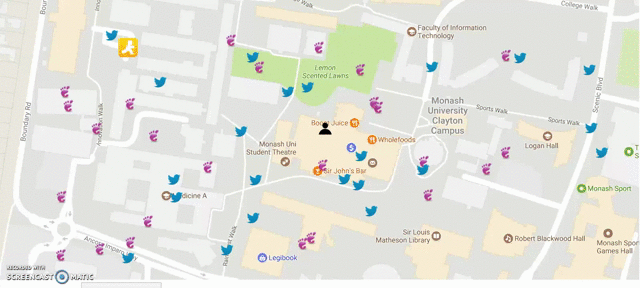

# Javascript Games

## Catch and Follow

Made in response to student elections at Monash University. Pink and Blue objects represent campaigners for the two main parties. The objective of the game is to avoid being 'caught' and safely navigate to a random location on the 'map' representing Monash campus.

* Use arrow keys to navigate the person icon on the map
* Try and reach the yellow running icon without getting 'caught'

## Block Game

Fusion of snakes and blocks.

* Players take turns to move
* Only move to blocks directly above, below, left or right.
* You can only move to position that are not occupied.
* Try and block the other player
* Whoever cannot move at a given stage loses

